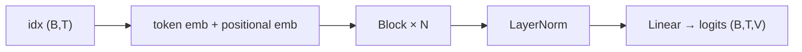

# GPT from Scratch

[](https://github.com/nathanaelhub/gpt-from-scratch/actions/workflows/ci.yml)

A decoder-only transformer — a small GPT — implemented in **NumPy only**. No
PyTorch, no autograd: every gradient, including the ones through multi-head
self-attention and LayerNorm, is derived and coded by hand, then **verified
against numerical finite differences** before any training happens.

It trains on character-level text (tiny-shakespeare by default) and generates
new text one character at a time.

The point is to make `loss.backward()` completely un-magical for a real
transformer — the same spirit as [backprop-from-scratch](https://github.com/nathanaelhub/backprop-from-scratch),
one architecture up.

## Quick start

```bash
python -m venv .venv && source .venv/bin/activate
pip install -r requirements.txt

python -m gpt.gradcheck          # verify every gradient (~1e-6 error) — do this first
python train.py                  # 2,000 steps on tiny-shakespeare (CPU, ~3 minutes)
python eval.py                   # exact val loss / perplexity / bits-per-char
python sample.py --prompt "ROMEO:" --n 400
```

Training checkpoints every `--eval-every` steps and on Ctrl-C, so a killed run
can be picked up with `python train.py --resume`.

## Architecture

Standard GPT-2-style decoder block, pre-norm with residuals:



Each **Block** is

```
x = x + CausalSelfAttention(LayerNorm(x))
x = x + MLP(LayerNorm(x))
```

Every layer (`Linear`, `Embedding`, `LayerNorm`, `Dropout`,
`CausalSelfAttention`, `MLP`, `Block`, `GPT`) is an object with a `forward` that
caches what it needs and a `backward` that returns the gradient w.r.t. its input
and stashes its parameter gradients — the chain rule, spelled out. See
[`gpt/model.py`](gpt/model.py).

## The math that's easy to get wrong

**Causal self-attention.** With per-head queries/keys/values `Q, K, V` of head
dim `d`:

```
S = QKᵀ / √d,  masked so position t sees only ≤ t
P = softmax(S)           A = P V
```

The backward pass threads through the softmax row-wise
(`dS = P ⊙ (dP − (dP·P)Σ)`), the `1/√d` scale, and the head split/merge — all in
[`CausalSelfAttention.backward`](gpt/model.py).

**LayerNorm.** For `ŷ = γ (x − μ)/√(σ²+ε) + β`, the input gradient is the usual

```
dx = (1/√(σ²+ε)) · (dŷ − mean(dŷ) − ŷ · mean(dŷ · ŷ)) / D
```

with `dŷ = dout ⊙ γ`. Getting the two mean-subtraction terms right is the whole
game; the gradient check is what tells you they are.

**Softmax + cross-entropy** collapse, as always, to `dlogits = P − onehot(y)`,
averaged over all `B·T` positions. The loss itself is computed as a log-softmax
(`logits − logsumexp`) rather than `log(softmax)`, so it stays exact when a
target's probability underflows to zero.

**Dropout** is inverted dropout (survivors scaled by `1/(1−p)`) on the summed
embeddings, on the attention weights after the softmax, and on each residual
branch. Its backward is just the cached mask — but through the attention
weights the mask sits *between* `P V` and the softmax Jacobian, which is the
easy place to get the order wrong. The gradient check runs with dropout on
(`gradcheck(dropout=0.2)`) by restarting the mask stream before every loss
call, so the finite differences see the same masks the backward pass did.

## Gradient checking

Before trusting a single training step, `gpt/gradcheck.py` compares each
parameter's analytic gradient to the central difference
`(L(w+ε) − L(w−ε)) / 2ε`. Every parameter agrees to a **max relative error of
~3e-6** — the strongest evidence the calculus is right, independent of whether
training happens to work:

```
$ python -m gpt.gradcheck
  ...
  block0.attn.c_attn.W   max rel err 2.83e-06  [ok]
  block0.ln1.gamma       max rel err 4.60e-08  [ok]
  ...
worst relative error across all parameters: 2.91e-06
PASS
```

## Training recipe

`train.py` follows the GPT-2 / nanoGPT recipe, all of it implemented here:

| flag | default | what |
|---|---|---|
| `--lr` / `--warmup` / `--min-lr` | 3e-3 / 100 / 3e-4 | linear warmup, then cosine decay to `min-lr` at the last step |
| `--weight-decay` | 0.1 | **decoupled** (AdamW) decay on matmul/embedding weights only — LayerNorm gains and biases are not decayed |
| `--grad-clip` | 1.0 | clip the global gradient norm; the pre-clip norm is printed each eval |
| `--dropout` | 0.1 | embeddings, attention weights, residual branches |
| `--dtype` | float32 | ~1.8× faster than float64 on CPU; the gradient check always uses float64 |
| `--eval-every` | 250 | evaluate, write `--log` (CSV), and checkpoint |
| `--resume` | | continue from `--out`: params, Adam moments, and step |

`plot_loss.py` turns the CSV into `docs/loss.png`. `eval.py` scores a checkpoint
on the *whole* validation split (train.py's running estimate is 20 random
batches) and reports perplexity and bits-per-character.

## Sampling

`sample.py` uses a **KV cache**: each new character runs only itself through
the model and attends to the cached keys/values, instead of re-running the
whole context. With learned absolute positions the cache can't slide, so once
the window is full it's rebuilt from the most recent `block_size/2` characters
and filling resumes; `--no-cache` recomputes the full window every step
(identical output within one window, a lot slower past it). `--temperature`
and `--top-k` do what you'd expect.

## Results

Training the default ~0.6 M-parameter model on tiny-shakespeare (2,000 steps,
a few minutes on CPU), cross-entropy drops from the `ln(vocab) ≈ 4.17` random
baseline to ~1.9, and the samples go from noise to Shakespeare-shaped text —
speaker headings, the play's blank-line structure, and mostly-real words:

```
ROMEO:
That wither the the all shyse shall my'sing,
Which fre coul me of dur surs lows,
I then bows to's us erveres that
ans the will fall the thy nour this.

COPUS:
And you the your russ.

LUCES O:
Now, to in be warwar!

First:
All mare more ervy words, I have lookely.
```

It has clearly learned English word shapes, punctuation, and the speaker/line
format — but it's a tiny character model trained for minutes, so it's not going
to write a real sonnet. More steps and a bigger `--n-embd`/`--n-layer` keep
improving it.

## Project layout

```
gpt-from-scratch/
├── gpt/
│   ├── model.py       # layers + GPT: forward and hand-derived backward, KV cache
│   ├── optim.py       # AdamW, gradient clipping, LR schedule
│   ├── data.py        # char-level tokenizer + batching
│   ├── checkpoint.py  # save/load model + optimizer state (atomic)
│   └── gradcheck.py   # numerical gradient verification
├── train.py           # training loop → checkpoint.npz + train_log.csv
├── eval.py            # exact validation loss / perplexity / bits-per-char
├── sample.py          # autoregressive generation (KV-cached)
├── plot_loss.py       # train_log.csv → docs/loss.png
├── tests/             # pytest: gradient check, causality, cache, convergence …
└── data/              # tiny-shakespeare
```

## Tests

```bash
pip install -r requirements-dev.txt
pytest            # 24 tests: gradient checks (with and without dropout), causality,
                  # KV cache == full recompute, schedule, AdamW, checkpoints, dtype …
```

CI runs the whole suite — including the gradient check — on every push.

## License

MIT — see [LICENSE](LICENSE).
